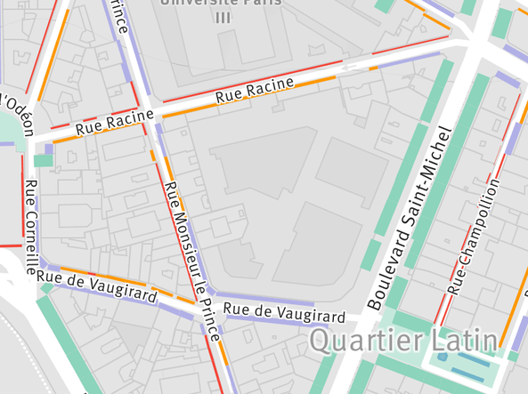
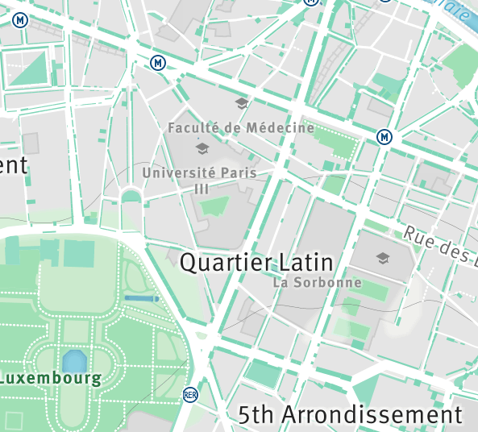
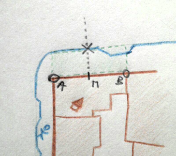

# What ?

Cities are [designed](pedestrian-cartoon-imbed.jpg) for cars.  We even use maps drawn for cars.
In cities like Paris, they are however a minor means of transportation : more than 25% of travel is made by public transport, and *more than 60% by walk*.

This project is an attempt to provide the width of the parisian sidewalks. The technique used to draw sidewalks does not produce beautiful nor complete shapes, but directly gives an estimation of their width, leading to this map of **sidewalks coloured by width**.

[See the maps](http://laem.github.io/trottoirs-de-paris/)

(*warning* : there seems to be  a horizontal offset that may alter the widths...)

<p align="center">
  
</p>

This second map is an early draft providing a **map for pedestrians**, that includes sidewalks, squares and parks (and could show trees, water fountains...).
Find the very large ones where you can skate freely or the very narrow ones which might be a problem for some people or during peak times.

<p align="center">
  
</p>

### Direct link to map tiles
[Sidewalk widths](https://api.tiles.mapbox.com/v4/trottoirs.9a57f77c/page.html?access_token=pk.eyJ1IjoidHJvdHRvaXJzIiwiYSI6IjFqTHpzN2sifQ.lKYhcpJGt4Xof8s98pDixQ#17/48.85546/2.34989)

[Map for pedestrians](https://api.tiles.mapbox.com/v4/laem.ca825d58/page.html?access_token=pk.eyJ1IjoibGFlbSIsImEiOiJ1Qjh4a1JNIn0.BGQeLm-XAzTgLF9t25VSKw#17/48.85275/2.34626)

### Source for figures : 
[bilan des déplacements à Paris](http://www.paris.fr/pratique/deplacements-voirie/dossier/bilan-des-deplacements-a-paris/le-bilan-des-deplacements-a-paris-en-2013/rub_7096_dossier_103374_port_16333_sheet_25892)


# How it works

1) Compute the sidewalk geojson shapes

The city of Paris gives two datasets : building polygons (in red) and sidewalk lines (in blue). 
We draw a sidewalk rectangle (green) for each exterior building edge, which gives us an estimation of the local width, as explained on this incredibly sophisticated drawing :



The algorithm uses mongodb's geospatial features, which is probably the wrong choice. Getting to know clojure was the main objective. 

2) Create the map

Import the sidewalk geojson as a source in Mapbox Studio, and style it with CartoCSS. The projects are in the `studio` dir. 


# Computing sidewalk shapes

Install mongodb 3 : http://docs.mongodb.org/manual/installation/
For ubuntu :
```
sudo apt-key adv --keyserver hkp://keyserver.ubuntu.com:80 --recv 7F0CEB10
echo "deb http://repo.mongodb.org/apt/ubuntu "$(lsb_release -sc)"/mongodb-org/3.0 multiverse" | sudo tee /etc/apt/sources.list.d/mongodb-org-3.0.list
sudo apt-get update
sudo apt-get install -y mongodb-org
```


Download the 'trottoirs' (pavements) geojson features, and transform it for import.

```
curl 'http://parisdata.opendatasoft.com/explore/dataset/trottoirs_des_rues_de_paris/download/?format=geojson&timezone=Europe/Berlin' > trottoirs_des_rues_de_paris.geojson
sed 's/{"type":"FeatureCollection","features"://g' trottoirs_des_rues_de_paris.geojson > tmpjson
sed '$s/.$//' tmpjson > mongoimport.json
```

BUT the Paris trottoirs geojson file has a weird offset. Correct that :

```
node d.js
mongoimport --db agreable --collection t --file d.ok.json --jsonArray
```


The operation should be repeated for the 'Volumes Batis' (buildings) [file](http://parisdata.opendatasoft.com/explore/dataset/volumesbatisparis2011/download/?format=geojson&timezone=Europe/Berlin). **Unfortunately**, some of them can't be indexed by mongoDB (malformed geojson polygons).
Download and import an export of the buildings filtered instead (~50 of them are missing).

```
curl https://copy.com/MaFNvfd7SoLTNEHn?download=1 > v-correct.tar.bz2
tar -jxvf v-correct.tar.bz2
mongoimport --db agreable --collection v --file v-correct.json
```

Finally, create an index for each collection :

```
mongo #enters mongo shell
use agreable
db.v.createIndex( { geometry : "2dsphere" } )
db.t.createIndex( { geometry : "2dsphere" } )
```

At this point, you can run the following commands, where `a` (l*a*titude), `o` (l*o*ngitude) and `r` (radius) define the bounding circle in sample runs. The algorithm is slow, a couple of minutes for a radius of 90 meters, hence the sample mode.

1) compute the sidewalk polygons in a sample circle, output to `trottoirs.geojson`
```
lein with-profile cl run -- -a 48.84630097640122 -o 2.378979921340942 -r 90
```
2) launch a web page that displays the resulting polygons on a map (and also overrides the above file).
```
lein ring server
# checkout localhost:3000/#t/[a]/[o]/[r], example:
# http://localhost:3000/#t/48.84630097640122/2.378979921340942/10
```
3) Compute everything, *it will take multiple hours*
```
lein with-profile cl run --
```


[Archive] failed attempt with topojson :

```
topojson -o t.topo.json trottoirs_des_rues_de_paris.geojson -q 1e6
# Change the topojson translation property, then back to geojson
tail -c 200 t.topo.json
sed "s/2.226665275505943/2.236665275505943/g" t.topo.json > t2.topo.json
topojson-geojson t2.topo.json

sed 's/{"type":"FeatureCollection","features"://g' trottoirs_des_rues_de_paris.json > tmpjson
sed '$s/.$//' tmpjson > mongoimport.topo.json

mongoimport --db agreable --collection t2 --file mongoimport.topo.json --jsonArray

# Mongo fails at indexing these topojson to geojson features...
```
